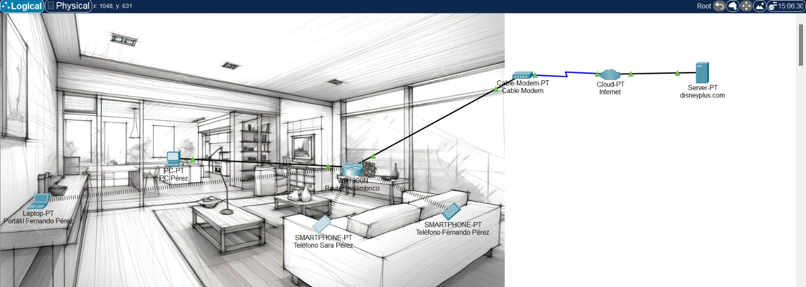

# Laboratorio I: Interconexión

## Integrantes:
- **Nicolás Almonacid Muñoz** (0000293190)
- **Juan Pablo Restrepo Coca** (0000305110)
- **Mariana Salas Gutiérrez** (0000296781)

## Introducción
Las redes son fundamentales 

## Objetivo
El objetivo del presente laboratorio es permitir que Fernando Pérez y sus familiares puedan acceder al sitio web de Disney+ desde sus hogares, utilizando sus dispositivos personales, mediante de una red y comunicación de datos.

## Metodología
Para llevar a cabo el laboratorio y desarrollar la solución de la problemática establecida, se emplea la herramienta de CISCO Packet Tracer con el fin de realizar el diseño de la red y su respectiva simulación.

## Desarrollo de la solución

### Elementos
- **Servidor:** disneyplus.com
- **Modem:** El dispositivo que permite la comunicación entre la red WAN y la casa de la familia Pérez.
- **Router:** Después de que el módem obtiene la información de Internet, este transmite los datos a los dispositivos personales.
- **Smartphones, laptop y PC:** Dispositivos desde los cuales los integrantes de la familia Pérez navegan por el sitio web de Disney +.
  
### Topología
En este caso, se utiliza la topología tipo estrella. Esta fue escogida por ser sencilla de implementar y de mantener, razones por las cuales es comúnmente utilizada en redes pequeñas o medianas, donde hay una cantidad limitada de dispositivos y una baja demanda de ancho de banda, tales como la red doméstica de la casa de la familia Pérez.

### Tipos de redes
- LAN: Una red de área local o LAN es una red que facilita la comunicación y el intercambio de datos entre dispositivos a nivel local a distancias limitadas. Por esto, este tipo de red se utiliza para hogares privados, como la casa de Fernando Perez.
- WAN: Red de área amplia Este tipo de red conecta equipos a distancias mucho mayores y se representa en la simulación en Cisco con Cloud-PT Internet.

### Protocolos y modelos
DNS (Sistema de nombres de dominio) y DHCP (Protocolo de configuración dinámica de host).
TCP/IP 

### Arquitecturas y servicios
Explora arquitecturas de red y servicios que pueden facilitar la navegación por el sitio web de DisneyPlus, como DNS (Sistema de nombres de dominio) y DHCP (Protocolo de configuración dinámica de host).

## Desafíos

## Conclusión

## Referencias
