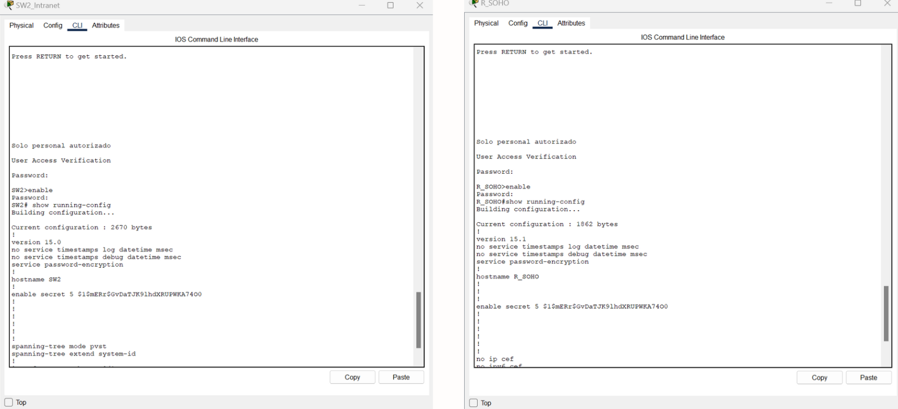

# Laboratorio II: Red SOHO

## Integrantes:
- **Nicolás Almonacid Muñoz** (0000293190)
- **Juan Pablo Restrepo Coca** (0000305110)
- **Mariana Salas Gutiérrez** (0000296781)

## Introducción
Las redes empresariales permiten la interconexión de múltiples dispositivos en entornos corporativos, facilitando la comunicación interna y el acceso a servicios externos, como internet. Este informe detalla el diseño, simulación y análisis de una red SOHO utilizando el software Cisco Packet Tracer, dando solución y planteando los desafíos y soluciones presentados durante la configuración y validación.

## Objetivo
El objetivo del presente laboratorio es diseñar, implementar y analizar una red empresarial que conecte distintos tipos de dispositivos, considerando distintos parámetros como eficiencia y optimización de recursos. En el diseño de esta red se emplean conceptos vistos en clase, conceptos claves en el área de las redes y comunicación de datos.

## 1. Metodología
Para llevar a cabo el laboratorio y desarrollar la solución de la problemática establecida, se emplea la herramienta de **Cisco Packet Tracer** [1] con el fin de realizar el diseño de la red y su respectiva simulación. Este software nos permite diseñar y simular el comportamiento de una red empresarial, probando las configuraciones de routers, switches, servidores y otros dispositivos necesarios para el funcionamiento de la red. Se configuraron distintos protocolos esenciales como DNS, DHCP y HTTP para asegurar el correcto funcionamiento de la red.
- **Montaje:** Inicialmente, se realiza el cableado estructurado. Luego, se agrega el módulo WIC-2T para conexiones seriales en los router, Wireless LAN Controller (WLC) 3504 y Lightweight Access Point (LAP) 3702i. Después, se realiza la conexión por medio de las interface. Finalmente, se agregan las viñetas y recuadros para que quede más organizado.
- **Configuración:** La primera configuración que se realiza es la de los dispositivos switch para crear las VLAN y definir sus puertos. Posteriormente, se configuraron los router para asignar las direcciones IP a las VLAN y definir el servidor DHCP. Tras configurar el router, se determina el servicio de DHCP en el server agregando un gateway, dirección IP de inicio y máscara de red para cada VLAN. A todos los routers y switches se les hizo la configuración básica (contraseña y hostname). Con las redes funcionando, se conectan a través de los routers determinados por rutas estáticas. Finalmente, se agregan los servicios de DNS y HTTP con sus respectivos servidores para poder acceder a una página web.
- **Verificación:** Primero, se envía un ping desde el router SOHO a los diferentes dispositivos para confirmar que estén bien conectados. Luego, se manda un ping desde PC1 a PC3 para verificar la conectividad entre la misma VLAN. De la misma manera, se revisa la conectividad entre VLAN diferentes. También se confirma que el WLC y el LAP puedan hacer ping entre ellos. Después, se manda un ping entre routers y cuando funciona, se envía otro pero desde un PC. La última prueba que se realizo fue abrir la página *www.jnm.net* desde un PC de prueba.

## 2. Resultados de configuración y verificación de funcionamiento de la topología

La topología de la red está diseñada para una empresa que conecta sus dispositivos a una red corporativa centralizada con acceso a una red más amplia (WAN) y a servicios externos. La red local se segmenta mediante VLANs para organizar y optimizar el tráfico de diferentes tipos de dispositivos, usuarios y servicios. Se implementan técnicas avanzadas de seguridad y administración para garantizar la estabilidad, confiabilidad y escalabilidad de la red a largo plazo.

**Figura 1.** Topología.

### Elementos
- **Access Point:** LAP1 utilizado para proporcionar conectividad inalámbrica.
- **Servidor:** Servidor DNS y servidor DHCP para la asignación de direcciones IP de manera dinámica.
- **Switches:** Se utilizaron switches 2960 para segmentar el tráfico en la red local.
- **Router:** Cisco 2811, el cual conecta la red local al ISP.
- **Dispositivos finales:** Laptops, PCs y smartphones que se intercomunican entre ellos.

### Tipos de redes
- **Red de Área Local (LAN):** Es el tipo de red empleada para la red implementada en este laboratorio.
- **Red de Área Local Inalámbrica (WLAN):** Para los dispositivos móviles, PCs, impresoras, tablets y laptops que usan medios no guiados.
- **Red de Área Amplia (WAN):** La red externa que permite el acceso a internet mediante el router.

### Protocolos, servicios y modelos
- DNS (Sistema de nombres de dominio).
- DHCP (Protocolo de configuración dinámica de direcciones IP).
- HTTP (Hypertext Transfer Protocol).
- Modelo TCP/IP.

**Figura 2.** Página personalizada.

### Segmentación mediante VLANs
Se crearon diferentes VLANs para organizar el tráfico en la red local:
- **VLAN 20:** Para dispositivos invitados como smartphones.
- **VLAN 40:** Para dispositivos internos como PCs y tablets.
- **VLAN 55:** Para el servidor y dispositivos del equipo de TI.
- **VLAN 99:** Nativa.

### Esquema de direccionamiento IPv4
Se aplicó una metodología de diseño estructurado, donde se segmentó la red en subredes adecuadas para garantizar la correcta distribución de direcciones IP. La segmentación asegura un manejo eficiente de los recursos de IP y la escalabilidad futura del sistema.

**Figura 3.** DHCP.

## 3. Respuestas a las preguntas formuladas en la sección de procedimiento

- **(1)**  El esquema de direccionamiento IPv4 basado en los requerimientos de red, y considerando X = 1, se presenta en las tablas de subnetting y direccionamiento en el apartado *4. Resultados y Análisis*.
  
- **(2)**  El montaje de la topología propuesta se puede visualizar en la *Figura 1*.
  
- **(3)**  A continuación, se evidencia la configuración básica en los routers y switches, definiendo una contraseña y hostname. A lo largo de la wiki se muestra evidencia de la correcta configuración de las VLAN y direcciones IP.
  
             
**Figura 4.** Configuración básica.
  
- **(4)**  Se emplea asignación y traducción estática para los servidores. Para la red de SOHO, los demás dispositivos cuentan con asignación dinámica por medio del DHCP. La traducción dinámica se puede aplicar a esta parte de la red considerando que podrían añadirse más dispositivos y hacerlo de forma manual no sería muy eficiente. NAT se debe configurar en el router, al igual que en R_SOHO se cofiguró la IP del DHCP Server.

- **(5)**  Para verificar la asignación eficiente del esquema de direccionamiento desarrollado (tabla de direccionamiento), se usa el comando TCP/IP *show ip interface brief*.
  
       
**Figura 5.** Direcciones IP de las Interfaces.
  
- **(6)  y  (7)** Para verificar que se hayan creado y configurado correctamente las VLANs que se definieron en la tabla de subnetting, se utiliza el comando *show vlan brief*.
  
       
**Figura 6.** VLANs.

- (8)  y  (9) Verifique que haya conectividad entre las PCs y dispositivos móviles pertenecientes a la misma VLAN. ¿Qué comandos TCP/IP debe utilizar? ¿Los PCs y dispositivos móviles tienen conectividad con su puerta de enlace? ¿Por qué ¿Existe conectividad entre PCs pertenecientes a VLAN distintas? ¿Por qué? Capture la verificación realizada.

- **(10)** El protocolo STP está configurado y el comando es *show spanning tree*. En este caso, la interface fa 0/1 de SW2 fue escogida como raíz por su menor prioridad y dirección MAC.
  
       
**Figura #.** Spanning-Tree.
  
- **(11)** El comando para realizar un telnet es *telnet Dirección_IP*. En la siguiente imagen se muestra que es posible hacer telnet de un PC a R_SOHO y switches.
  
       
**Figura #.** Telnet.

- (12) Rutas

- (13) DNS

- **(14)** No se utilizó otro servicio adicional.

- **(15)** Los archivos con las configuraciones TXT se encuentran anexadas en la tarea de Teams.

## 4. Resultados y Análisis

### 1) Responda a cada una de las preguntas guías del diseño estructurado propuesta en clase y documente todo el proceso de desarrollo del esquema de direccionamiento IPv4 propuesto por su equipo y diligencie las tablas de subneteo y direccionamiento de la red. 

#### Preguntas

- **¿Cuántas subredes necesito?** 172.17.0.0 / 16 necesita 4 subredes para la topología propuesta.
- **¿Cuántos hosts requieren?** VLAN 20 y VLAN 40 requieren 1022 hosts, VLAN 55 y 99 requieren de 254 hosts.
- **¿Qué dispositivos son parte de cada subnet?**
     * *VLAN 20:* Para PC1, PC3 y Smartphone.
     * *VLAN 40:* Para PC2, PC4 y Tablet.
     * *VLAN 55:* Para Servers, Printers y Laptop.
     * *VLAN 99:* Para nodos intermedios.
- **¿Cuáles son privadas y públicas?** Los nodos finales que quieren acceder a internet necesitan direcciones públicas, los demás pueden tener direcciones privadas.
- **¿Dónde deberían conservarse las direcciones?** Las direcciones son estáticas en los servidores. Las demás pueden ser dinámicas.
- **¿Cómo se asignan los dispositivos y las interfaces?** Se muestra en las tablas a continuación.

#### Tabla de Subnetting

#### Tabla de Direccionamiento

###2) Presente el análisis y proceso de configuración de los servicios de red requeridos para el correcto funcionamiento de la red empresarial. 

###3) Evalúe el flujo bidireccional de datos generado al acceder a la página alojada en el servidor Web por los nodos terminales (PCs y dispositivos móviles) de las diferentes VLANs que conforman la topología de la Figura 1, utilizando el servicio DNS. Como también, al verificar la conectividad de un PCs a otro y de un PC al Gateway. Justifique su análisis utilizando capturas con el simulador y los filtros de paquetes de Cisco Packet Tracer. 

## 5. Desafíos
Durante el proceso de configuración en **Cisco Packet Tracer**, uno de los desafíos más grandes fue la correcta configuración de las VLANs y la asignación de direcciones IP dinámicas utilizando DHCP. La configuración del WLC también fue un gran reto a solucionar.

## 6. Conclusiones y Recomendaciones
En conclusión, la propuesta de la red empresarial permite la correcta conexión de una red de área local al internet. Durante el desarrollo de la solución se presentaron desafíos, especialmente en la implementación de VLANs y servicios avanzados como NAT y AAA. A pesar de los retos, este trabajo reforzó los conocimientos del grupo sobre el diseño de redes empresariales y la configuración de dispositivos en **Cisco Packet Tracer**.

## 7. Referencias
[1] "Cisco Packet Tracer", *Cisco Systems*, 2024. [Enlace]. Disponible: https://www.netacad.com/courses/networking/
